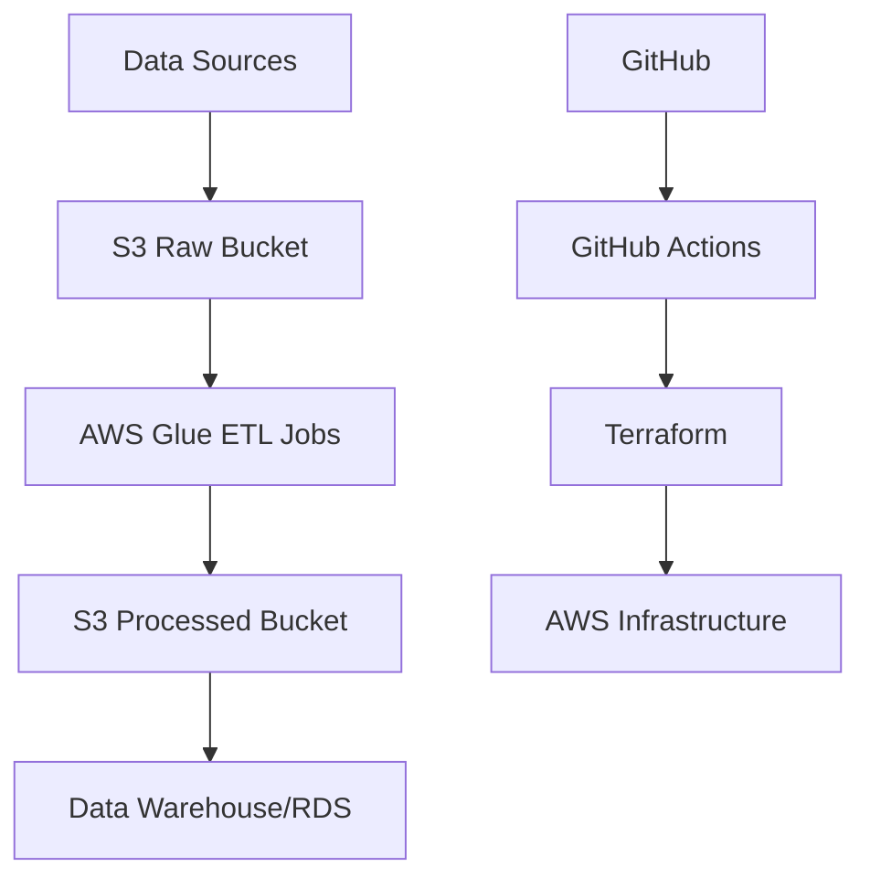

# AWS ETL Pipeline with Terraform CI/CD

A comprehensive ETL pipeline using AWS Glue, S3, and database scripts with Terraform-based CI/CD pipeline designed for easy management by junior developers.

## 📁 Project Structure

```
aws-etl-pipeline/
├── .github/
│   └── workflows/
│       ├── deploy-dev.yml
│       ├── deploy-staging.yml
│       └── deploy-prod.yml
├── glue_jobs/
│   ├── extract/
│   ├── transform/
│   └── load/
├── database/
│   ├── migrations/
│   ├── schemas/
│   └── scripts/
├── terraform/
│   ├── environments/
│   ├── modules/
│   └── shared/
├── config/
│   ├── dev.yml
│   ├── staging.yml
│   └── prod.yml
├── scripts/
└── docs/
```

## 🚀 Quick Start

### Prerequisites
- AWS CLI configured
- Terraform >= 1.0
- Python 3.8+
- Docker (for local testing)

### Environment Setup

1. **Clone the repository**
   ```bash
   git clone https://github.com/144853/aws-etl-pipeline.git
   cd aws-etl-pipeline
   ```

2. **Configure environment variables**
   ```bash
   cp config/dev.yml.example config/dev.yml
   # Edit config/dev.yml with your settings
   ```

3. **Initialize Terraform**
   ```bash
   cd terraform/environments/dev
   terraform init
   terraform plan
   terraform apply
   ```

### For Junior Developers 👨‍💻👩‍💻

**Simple Configuration Changes:**
- Edit files in `config/` directory to change environment settings
- Modify `glue_jobs/` scripts for ETL logic changes
- Update database schemas in `database/schemas/`

**Common Tasks:**
- **Add new Glue job**: Copy template from `glue_jobs/templates/`
- **Database changes**: Add migration in `database/migrations/`
- **Config updates**: Edit YAML files in `config/`

## 🔧 Configuration Management

All configurations are centralized in YAML files for easy management:

- `config/dev.yml` - Development environment
- `config/staging.yml` - Staging environment  
- `config/prod.yml` - Production environment

## 📚 Documentation

- [Architecture Overview](docs/architecture.md)
- [Deployment Guide](docs/deployment.md)
- [Development Workflow](docs/development.md)
- [Troubleshooting](docs/troubleshooting.md)

## 🏗️ Architecture



## 🔄 CI/CD Pipeline

The pipeline automatically:
1. **Validates** Terraform configurations
2. **Tests** Glue job syntax
3. **Deploys** infrastructure changes
4. **Updates** Glue jobs and database schemas
5. **Runs** integration tests

## 🤝 Contributing

1. Create feature branch
2. Make changes
3. Test locally
4. Submit PR
5. Pipeline automatically deploys to dev environment

## 📞 Support

For questions or issues:
- Check [docs/troubleshooting.md](docs/troubleshooting.md)
- Create an issue in this repository
- Contact the data engineering team

## 📄 License

MIT License - see [LICENSE](LICENSE) file for details.